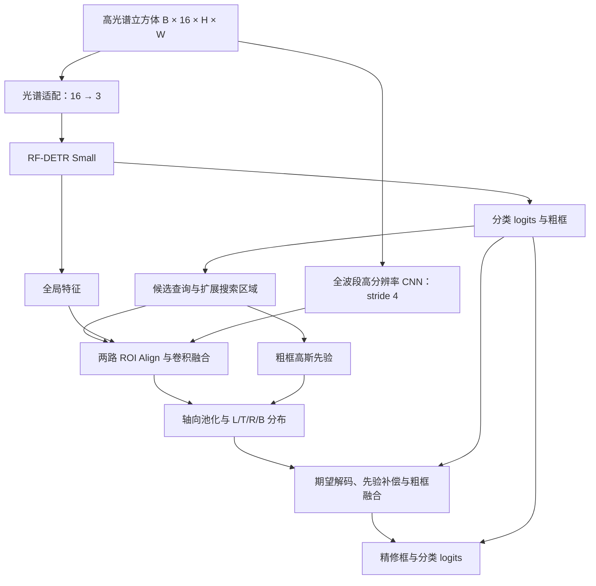

# HiFR-RFDETR

**Hi**gh-resolution **F**usion and **R**efinement for Hyperspectral Object Detection.

基于 **RF-DETR Small** 的 16 波段高光谱目标检测实现，结合可学习光谱适配、高分辨率局部特征融合与四边概率分布精修。

代码围绕模型结构、前向计算、候选匹配和精修损失组织，可接入已有训练流程。

## 模型结构

- **光谱适配**：可学习的 `1×1` 卷积将 16 波段映射到 3 通道，采用 Xavier 均匀初始化、零偏置，随后缩放和归一化后送入 RF-DETR。
- **高分辨率融合**：轻量 CNN 直接读取全部波段，生成保留输入长宽比的 stride-4 特征；与检测器全局特征在同一搜索区域内进行 ROI Align，再通过卷积融合。
- **边界分布精修**：沿水平和垂直方向池化局部特征，预测左、上、右、下四条边的概率分布，通过期望解码得到连续坐标。粗框高斯先验与零初始化残差共同保持初始粗框，`refine_blend` 控制最终融合比例。

RF-DETR 提供分类 logits 与粗框，融合分支进一步精修候选框。



训练候选取置信度 TopK 与 Hungarian 匹配正样本的并集，包含 Group-DETR 各组正样本。精修损失在搜索区域与分布坐标覆盖的目标上计算，检测损失监督上游粗输出。

## 模型接口

| 项目 | 约定 |
|---|---|
| `cubes` | `B×16×H×W` 的 `float32` 张量，数值范围 `[0,1]`，同一批次尺寸一致 |
| `targets` | 每张图对应一个字典，含归一化 `cxcywh` 格式的 `boxes`（`N×4`、`float32`）与 `labels`（`N`、`int64`） |
| `pred_logits` | RF-DETR 分类 logits，类别编号由 `num_classes` 与 `class_offset` 指定 |
| `pred_boxes` | `B×Q×4` 的归一化 `cxcywh` 框，选中查询使用精修结果 |
| `refinement` | 候选索引、搜索区域与边界预测；`baseline` 模式为 `None` |

输入与模型放在同一设备，类别编号取 `[class_offset, class_offset + num_classes)`。

组合损失为上游检测损失，加上边界软标签交叉熵、精修框 L1 与 GIoU；后三项默认权重分别为 `1`、`5`、`2`。边界软标签按相邻 bin 插值，精修损失监督融合前的框。

## 接入

使用 Python 3.10 及以上版本，依赖固定 `rfdetr==1.3.0` 及配套 PyTorch、Transformers、PEFT、timm 版本。在仓库根目录安装：

```powershell
python -m pip install -e .
```

在已有流程中准备 `cubes` 和 `targets`，通过工厂构建模型与损失：

```python
from hsi_refine import ModelConfig
from hsi_refine.factory import build_rfdetr_model

config = ModelConfig(num_classes=18, mode="combined")
model, criterion = build_rfdetr_model(
    config, device="cuda", initialize_pretrained=True
)
outputs = model(cubes, targets)
losses, roi_stats = criterion(outputs, targets)
loss = criterion.total(losses)
```

`initialize_pretrained=True` 加载上游 COCO 权重；`detector_checkpoint` 与 `adapter_checkpoint` 导入已有组件权重。精修分支单独训练时，先导入训练好的检测器和光谱适配权重，再设置 `freeze_detector=True` 固定这两个组件。

训练时使用 `model.train()` 与 `criterion.train()`，计算验证损失时同时使用 `model.eval()` 与 `criterion.eval()`。推理时使用 `model.eval()`，调用 `model(cubes)`。

`ModelConfig` 集中配置检测器尺寸、融合通道、ROI 大小、边界 bin 数、搜索区域与候选分块。默认 `combined` 使用两路融合与边界分布；`baseline`、`highres`、`locnet` 分别提供基础检测、局部融合与坐标偏移、全局 ROI 与边界分布三种结构变体。

## 代码组织

| 文件 | 职责 |
|---|---|
| `hsi_refine/modules.py` | 光谱适配、高分辨率 CNN、ROI 融合与边界头 |
| `hsi_refine/model.py` | 组合前向、候选选择与精修框写回 |
| `hsi_refine/geometry.py` | 坐标转换、搜索区域、ROI Align 与 GIoU |
| `hsi_refine/losses.py` | 边界分布与精修框损失 |
| `hsi_refine/factory.py`、`weights.py` | RF-DETR 构建、损失接入与组件权重导入 |
| `hsi_refine/config.py` | 模型结构配置 |
| `tests/` | 核心模块与真实 RF-DETR 接入检查 |

检查命令：`python -m unittest discover -s tests -v`。

## 方法来源

- [RF-DETR 官方工程（1.3.0）](https://github.com/roboflow/rf-detr/tree/1.3.0)：检测主干、Group-DETR 匹配、迭代框更新与基础损失。
- [LocNet](https://arxiv.org/abs/1511.07763)，Gidaris 与 Komodakis，CVPR 2016：边界概率分布定位的思想来源。
- [Domain Adaptor Networks for Hyperspectral Image Recognition](https://arxiv.org/abs/2108.01555)，Perez 与 Maji，2021：高光谱输入适配相关工作。

本项目代码使用 [MIT 许可](LICENSE)，外部依赖遵循各自许可。
