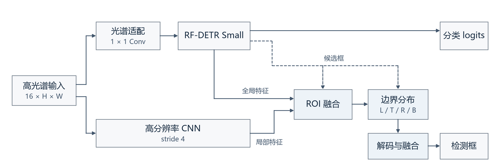
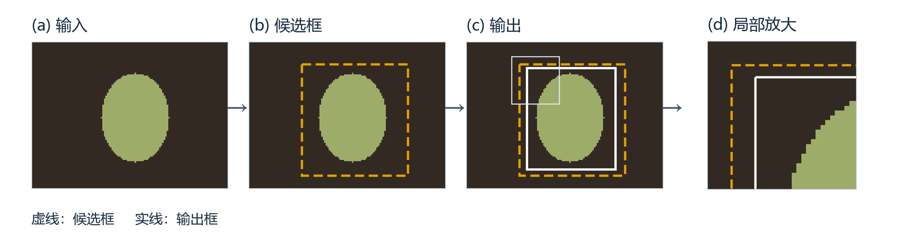

# HiFR-RFDETR

**面向高光谱目标检测的高分辨率融合与边界精修。**

High-resolution Fusion and Refinement for Hyperspectral Object Detection.

HiFR-RFDETR 将 16 波段高光谱输入接入 RF-DETR Small：先定位目标，再结合全局信息与高分辨率局部细节调整检测框的四条边。分类输出由 RF-DETR 提供，精修分支专注于边界位置。

**竞赛成绩：** [Hyperspectral Object Detection Challenge 2026](https://www.kaggle.com/competitions/hyperspectral-object-detection-challenge-2026/leaderboard) 最终排名 **37 / 309（TOP 12%）**。

[模型概览](#模型概览) · [接入](#接入) · [实现细节](#实现细节) · [流程示意](#流程示意) · [代码与检查](#代码与检查)

## 模型概览

- **接入光谱信息**：可学习的适配层将高光谱输入转换为 RF-DETR 所需的三通道表示。
- **融合全局与局部特征**：检测主干提供全局信息，高分辨率分支直接读取全部波段；两路特征在同一候选区域内融合。
- **调整四条边界**：预测左、上、右、下边界的位置分布，解码后与粗框融合，保留原始分类输出。



[查看矢量架构图](docs/assets/architecture.svg)

适合在已有高光谱训练流程中接入模型、匹配和损失，也可通过 `baseline`、`highres`、`locnet`、`combined` 四种模式比较模块作用。

## 接入

使用 Python 3.10 及以上版本。在仓库根目录安装：

```shell
python -m pip install -e .
```

依赖固定 `rfdetr==1.3.0` 及配套 PyTorch、Transformers、PEFT、timm 版本，详见 [requirements.txt](requirements.txt)。

先运行完整示例。默认使用 CPU、随机初始化模型和一张 `16×64×96` 的合成输入，无需下载权重：

```shell
python -m examples.quickstart --phase infer
python -m examples.quickstart --phase train
python -m examples.quickstart --phase validate
```

三个入口分别执行推理、一次参数更新、一次验证；使用 GPU 时追加 `--device cuda`。[示例源码](examples/quickstart.py) 包含输入与标注构造、模型初始化、损失计算，以及推理时的类别筛选和像素坐标转换。

接入自己的数据时，替换示例中的 `make_batch()`，并按数据集设置 `ModelConfig.num_classes` 与 `class_offset`。模型和损失通过 `build_rfdetr_model()` 一起构建，输入、标注和模型需放在同一设备。

输入约定：

| 项目 | 约定 |
|---|---|
| `cubes` | `B×16×H×W` 的 `float32` 张量，数值范围 `[0,1]`，同一批次尺寸一致 |
| `targets` | 每张图对应一个字典，含归一化 `cxcywh` 格式的 `boxes`（`N×4`、`float32`）与 `labels`（`N`、`int64`） |
| 类别编号 | `[class_offset, class_offset + num_classes)` |
| `pred_logits` | RF-DETR 原始分类 logits |
| `pred_boxes` | `B×Q×4` 的归一化 `cxcywh` 框，选中查询使用精修结果 |
| `refinement` | 候选索引、搜索区域、边界预测与监督匹配状态；`baseline` 模式为 `None` |

训练时，模型和损失模块均设为 `.train()`，用 `outputs = model(cubes, targets)` 计算前向结果，再由 `criterion(outputs, targets)` 和 `criterion.total(losses)` 得到总损失。

验证时，两者均设为 `.eval()`，在 `torch.no_grad()` 内调用一次 `model(cubes, targets)`，同一份结果即可用于预测和计算验证损失。标注仅为已选中的候选建立损失匹配，预测框和分类输出与不传标注时一致。推理入口则直接调用 `model(cubes)`。

启用精修分支时，计算训练或验证损失均需将同一份 `targets` 传给模型和损失模块；漏传给模型会明确报错。没有目标的图像传入空 `boxes` 和 `labels`。`roi_stats` 中的 `matched_rois` 与 `supervised_rois` 分别表示选中候选内的匹配数和实际监督数；验证时，匹配目标不在 TopK 内可使这两个值为零。

`initialize_pretrained=True` 加载上游 COCO 权重；`detector_checkpoint` 与 `adapter_checkpoint` 导入已有组件权重。精修分支单独训练时，先导入训练好的检测器和光谱适配权重，再设置 `freeze_detector=True` 固定这两个组件。

## 实现细节

### 光谱适配与特征融合

光谱适配使用可学习的 `1×1` 卷积将 16 波段映射到 3 通道，采用 Xavier 均匀初始化、零偏置；随后缩放和归一化，送入 RF-DETR。

高分辨率 CNN 直接读取全部波段，生成保留输入长宽比的 stride-4 特征。它与检测器全局特征在同一搜索区域内进行 ROI Align，再通过卷积融合。

### 边界分布与候选选择

融合特征沿水平和垂直方向池化，预测四条边的概率分布，通过期望解码得到连续坐标。粗框高斯先验与零初始化残差共同保持有效初始粗框，`refine_blend` 控制最终融合比例。

| 阶段 | 精修候选 | 标注的作用 |
|---|---|---|
| 训练 | 置信度 TopK 与匹配正样本的并集 | 包含 Group-DETR 各组正样本，为精修建立监督 |
| 验证 | 仅置信度 TopK，与无标注推理一致 | 为已选候选建立损失匹配 |
| 推理 | 仅置信度 TopK | 无需标注 |

### 损失与结构变体

组合损失为上游检测损失，加上边界软标签交叉熵、精修框 L1 与 GIoU；后三项默认权重分别为 `1`、`5`、`2`。边界软标签按相邻 bin 插值，精修损失监督融合前的框，并只在搜索区域与分布坐标覆盖的目标上计算。

| 模式 | 局部特征来源 | 边界预测 |
|---|---|---|
| `baseline` | RF-DETR 基础检测 | 使用粗框 |
| `highres` | 全局 ROI + 高分辨率 ROI | 坐标偏移 |
| `locnet` | 全局 ROI | 四边概率分布 |
| `combined`（默认） | 全局 ROI + 高分辨率 ROI | 四边概率分布 |

`ModelConfig` 集中配置检测器尺寸、融合通道、ROI 大小、边界 bin 数、搜索区域与候选分块。

### 流程示意



[图示说明](docs/figures.md)

## 代码与检查

| 文件 | 职责 |
|---|---|
| [modules.py](hsi_refine/modules.py) | 光谱适配、高分辨率 CNN、ROI 融合与边界头 |
| [model.py](hsi_refine/model.py) | 组合前向、候选选择与精修框写回 |
| [geometry.py](hsi_refine/geometry.py) | 坐标转换、搜索区域、ROI Align 与 GIoU |
| [losses.py](hsi_refine/losses.py) | 边界分布与精修框损失 |
| [factory.py](hsi_refine/factory.py)、[weights.py](hsi_refine/weights.py) | RF-DETR 构建、损失接入与组件权重导入 |
| [config.py](hsi_refine/config.py) | 模型结构配置 |
| [parallel.py](hsi_refine/parallel.py) | 按图片拆分标注、合并候选编号的 DataParallel 封装 |
| [quickstart.py](examples/quickstart.py) | 可直接运行的训练、验证与推理示例 |
| [tests/](tests/) | 核心模块与真实 RF-DETR 接入检查 |
| [图示说明](docs/figures.md) | 首页图示来源、坐标和重新生成方法 |

```shell
python -m unittest discover -s tests -v
```

## 方法来源

- [RF-DETR 官方工程（1.3.0）](https://github.com/roboflow/rf-detr/tree/1.3.0)：检测主干、Group-DETR 匹配、迭代框更新与基础损失。
- [LocNet](https://arxiv.org/abs/1511.07763)，Gidaris 与 Komodakis，CVPR 2016：边界概率分布定位的思想来源。
- [Domain Adaptor Networks for Hyperspectral Image Recognition](https://arxiv.org/abs/2108.01555)，Perez 与 Maji，2021：高光谱输入适配相关工作。

本项目代码使用 [MIT 许可](LICENSE)，外部依赖遵循各自许可。
